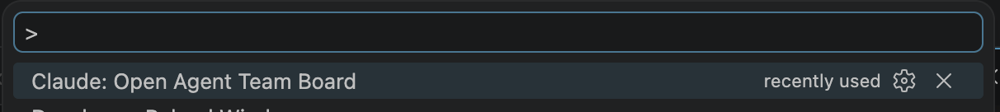

# Claude Agent Team Board


A Kanban board that displays the internal task list from [Claude Code agent teams](https://code.claude.com/docs/en/agent-teams) inside VS Code.

When you orchestrate a team of Claude Code sessions, each teammate claims and completes tasks from a shared task list stored on disk. This extension watches that task list and renders it as a live Kanban board so you can see what every teammate is working on at a glance.

## Features

- **3-Column Kanban Board** -- Pending, In Progress, and Completed columns with task counts and color-coded accents
- **Live Updates** -- File watcher automatically refreshes the board when tasks change on disk
- **Team Member Display** -- Shows team members with deterministically assigned animal emoji icons
- **VS Code Theme Integration** -- Adapts to your current light or dark theme via CSS variables
- **Configurable Task Directory** -- Override the default `~/.claude/tasks/` path in settings
- **Team Selector** -- Switch between multiple teams with a quick pick menu


## Usage

1. Install from the [VS Code Marketplace](https://marketplace.visualstudio.com/items?itemName=ericman93.claude-agent-team-kanban).
2. Open the command palette (`Cmd+Shift+P` / `Ctrl+Shift+P`)
3. Type and select **Claude: Open Agent Team Board**
4. If multiple teams are detected, pick one from the dropdown

The board updates automatically as task files change on disk — no manual refresh needed!



## Configuration

| Setting | Default | Description |
|---------|---------|-------------|
| `claude-agent-team-board.tasksDirectory` | `~/.claude/tasks` (auto-detected) | Path to the Claude Code tasks directory |
| `claude-agent-team-board.teamsDirectory` | `~/.claude/teams` (auto-detected) | Path to the Claude Code teams directory |

## How It Works

Claude Code [agent teams](https://code.claude.com/docs/en/agent-teams) coordinate through a shared task list stored at `~/.claude/tasks/{team-name}/`. Each task has a status (`pending`, `in_progress`, or `completed`), an owner, and optional dependency information (`blocks`/`blockedBy`). Team configuration lives at `~/.claude/teams/{team-name}/config.json`.

This extension reads those files and renders them as a Kanban board. A file system watcher monitors the task directory for changes and pushes updates to the webview in real time.

## Development

```bash
npm run watch    # Recompile on file changes
```

Press **F5** in VS Code to launch an Extension Development Host with the extension loaded.

## License

MIT
